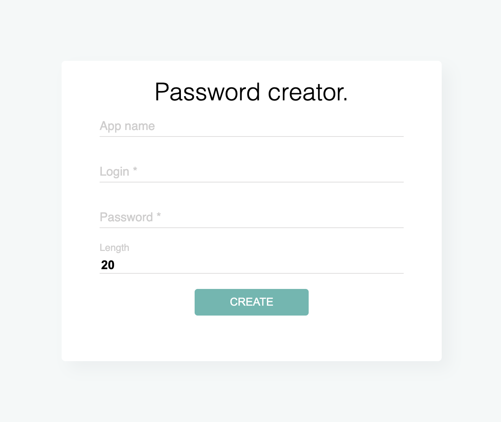

---

This tool helps you to create a strong password by using a simple one.
It uses [SHA3](https://en.wikipedia.org/wiki/SHA-3) algorithm under the hood.

### Examples

You need to know only one password. For example - `supermanpass`.

- Message: `superman33@gmail.com`
- Passowrd: `supermanpass`
- Length: `20`
- Result: `7gH12wa0EraHPFDPghih`
---
- Message: `steam superman33`
- Passowrd: `supermanpass`
- Length: `5`
- Result: `Yg7tK`
---
- Message: `gmail:superman33`
- Passowrd: `supermanpass`
- Length: `30`
- Result: `6gxkRNnwJ6nHaCODM0Yn9vSR135Edu`
---
- Message: `instagram mega_cat`
- Passowrd: `supermanpass`
- Length: `10`
- Result: `7AcAFKqzaA`

#### Simple rule of security: Each account must have a unique password
